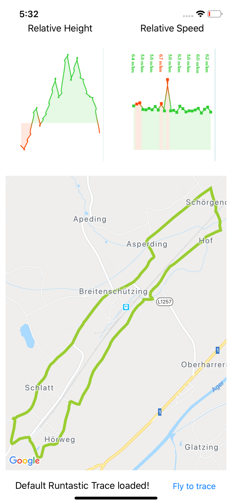
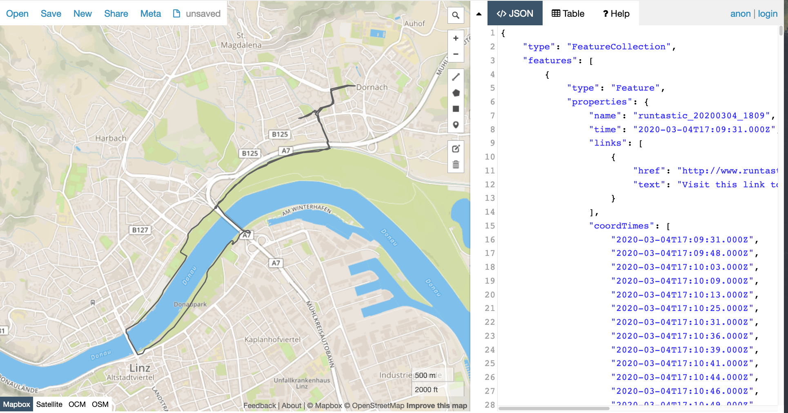

# RuntasticViewer

Display data about a running trace exported from adidas running.

## Functionality

This Xamarin.Forms cross-platform application can be used to visualize running logs, exported from the adidas Running (formerly known as _Runtastic_) application.
As seen in the screenshot above, the application displays a given running track and charts according to the logged height and current speed over the whole running session. All this data is parsed and calculated from the exported files from _adidas Running_.
Furthermore, by clicking the `fly to trace`-Button, the map will center back on the location of the trace if the screen has been moved beforehand.

Currently, the application does not support dynamically loading JSON-files at run-time, so if you want to display a running trace different to the built-in one, you can easily download and convert your own trace by following the instructions here.

## Displaying your own traces

- head over to [runtastic.com](https://www.runtastic.com), log in to your account and click on settings in your the dropdown menu near your user icon.
- Click on `Export Data` and wait until the export is finished and you get a mail from adidas running with a download link to the export. 
- Follow that link, extract the downloaded data and open the resulting file in a terminal window.
- Since we are only concerned about the running data (and mostly GPS logs) we `cd` into `Sport-Sessions/GPS-data`
- In this folder, we can see a lot of GPS tracks in the form of `.gpx`-files. Pick one of them which you want to display. Let's call that one route.gpx
- We now need to convert that .gpx file to a geojson (`.json`) file. For one simple file, we can just copy and paste the `.gpx` file content into [an online converter](https://mapbox.github.io/togeojson/) and copy the results into a file called `defaultTrace.json`
- If you're already interested in how the trace looks, you can paste the files content into [this awesome geojson online viewer](http://geojson.io). An example trace can look like this 
- Last but not least, move the `defaultTrace.json` file to the `RuntasticViewer/Assets/Resources/` folder in your project directory.

* Build the project in Visual Studio or Rider and deploy it to the device of your choice!

There also is an automized version of all steps after downloading and extracting the data (except the build and deploy-step) in the file convert.sh.

This script has only been tested on macOs yet.

## TODO

- why using xamarin is a good/bad idea
- download links
- Links to convert.sh and defaultTrace.json on GitHub
